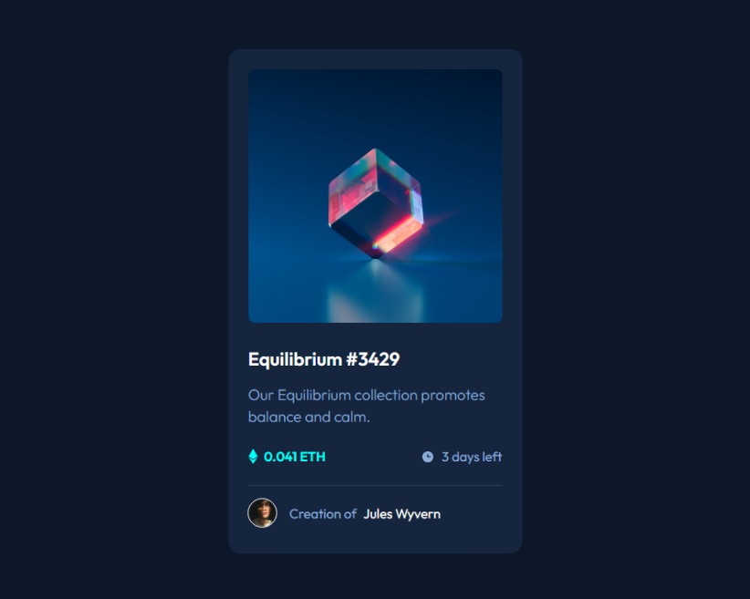
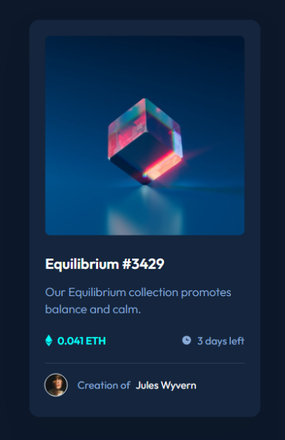
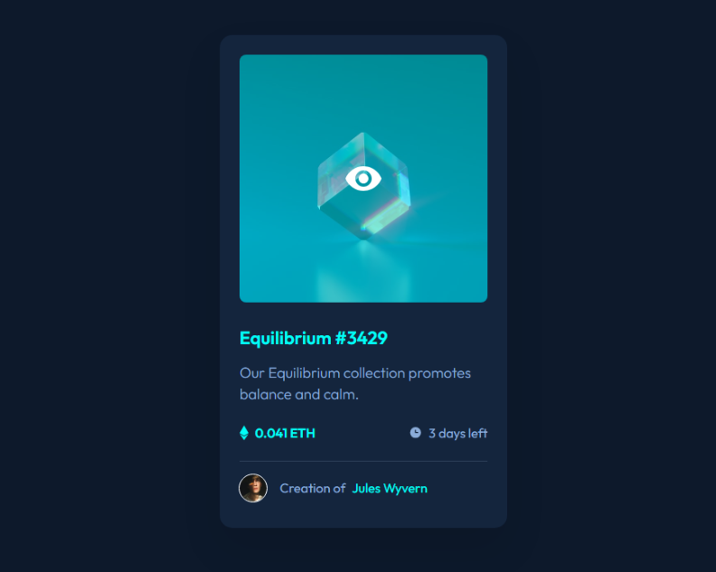

# Frontend Mentor - NFT preview card component solution

This is a solution to the [NFT preview card component challenge on Frontend Mentor](https://www.frontendmentor.io/challenges/nft-preview-card-component-SbdUL_w0U). Frontend Mentor challenges help you improve your coding skills by building realistic projects.

## Table of contents

- [Overview](#overview)
  - [The challenge](#the-challenge)
  - [Screenshot](#screenshot)
  - [Links](#links)
- [My process](#my-process)
  - [Built with](#built-with)
  - [What I learned](#what-i-learned)
  - [Continued development](#continued-development)
- [Author](#author)

## Overview

### The challenge

Users should be able to:

- View the optimal layout depending on their device's screen size
- See hover states for interactive elements

### Screenshot

#### Desktop Preview



#### Mobile Preview



#### Active Preview



### Links

- Solution URL: [https://www.frontendmentor.io/solutions/nft-preview-card-component-OpcVRjtmMo](https://www.frontendmentor.io/solutions/nft-preview-card-component-OpcVRjtmMo)
- Live Site URL: [https://nft-preview-card-component-prj.netlify.app](https://nft-preview-card-component-prj.netlify.app)

## My process

### Built with

- Semantic HTML5 markup
- CSS Variables
- CSS Flexbox

### What I learned

I learned how to write clean HTML and CSS code, using CSS utilities classes and CSS Variables (custom properties), for different styles, such as:

- Background color and Text color.
- Font sizes and Text styles.
- Margin and Padding.

In this way the CSS elements are not fill with bunch of different CSS properties, and it puts everything in logical order.

Here are some examples from the code:

```html
<div class="card bg-strong-blue px-md pt-md pb-lg"></div>
```

```css
/* Padding */
.pt-md {
  padding-top: 24px;
}

.pb-lg {
  padding-bottom: 32px;
}

.px-md {
  padding-left: 24px;
  padding-right: 24px;
}
```

```html
<p class="text-white text-sm ml-sm">
  <span class="text-soft-blue mr-xsm">Creation of</span>
  <span class="author-name">Jules Wyvern</span>
</p>
```

```css
/* Margin */
.mr-xsm {
  margin-right: 5px;
}

.ml-sm {
  margin-left: 16px;
}
```

I also learned how to create image hover overlay using `:hover`, `::before` and `::after` CSS Pseudo-elements.

Here is an example from the code:

```html
<figure class="card-img">
  
  <figcaption></figcaption>
</figure>
```

```css
.card .card-img img {
  width: 302px;
  height: 302px;
  border-radius: 8px;
}

.card .card-img {
  position: relative;
}

.card .card-img::after,
.card .card-img::before {
  display: none;
  position: absolute;
  top: 0;
  left: 0;
  content: " ";
  width: 302px;
  height: 302px;
}

.card .card-img::after {
  border-radius: 8px;
  opacity: 0.5;
  background-color: var(--cyan);
}

.card .card-img::before {
  background-image: url("/images/icon-view.svg");
  background-size: auto;
  background-position: center;
  background-repeat: no-repeat;
  z-index: 1;
  cursor: pointer;
}

.card .card-img:hover::before,
.card .card-img:hover::after {
  display: block;
}
```

### Continued development

I will keep improving my HTML and CSS skills and learning new tricks and techniques.

I will be focusing specifically on mastering CSS Flexbox and Grid techniques and responsive web design.

## Author

- Frontend Mentor - [@rosenblumitamar](https://www.frontendmentor.io/profile/rosenblumitamar)
- Twitter - [@rosenblumitamar](https://x.com/ItamarRosenblum)
